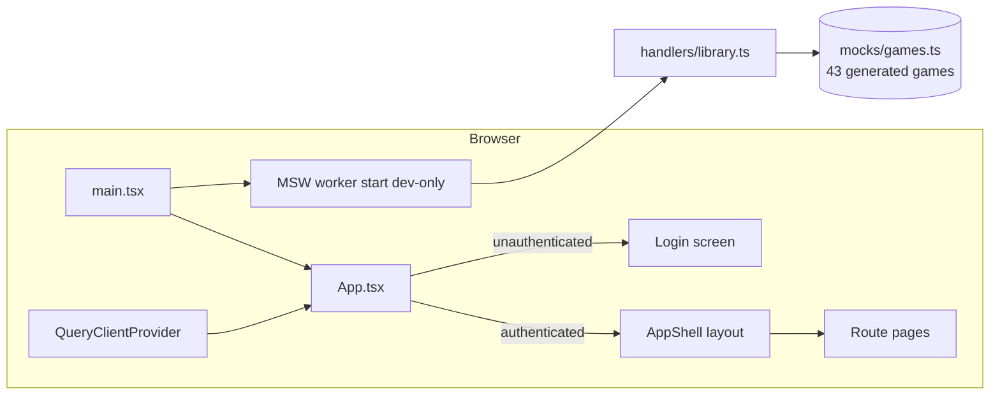

# NexusPlay — Architecture

> Unified game-library UI concept · Vite + React SPA. All data is mocked via a service worker; there is **no real backend**.

## 1. High-level shape



- **Entry (`src/main.tsx`)**: starts the Mock Service Worker **only in development** (`import.meta.env.DEV`, unhandled requests bypassed), then mounts `<App />` in React StrictMode.
- **Root (`src/App.tsx`)**: wraps everything in `QueryClientProvider` + `BrowserRouter`. A single `isAuthenticated` useState acts as the auth gate — logged-out users see the Login route (catch-all `*`), logged-in users get the AppShell routes.
- **Data flow**: pages are currently presentational with inline constants; the MSW layer exists so data-driven screens (e.g. Library) can graduate to `useQuery` fetches against `/api/library` without code changes elsewhere.

## 2. Directory map

```
nexusplay/
├── index.html                  # Vite entry document
├── src/
│   ├── main.tsx                # Dev-only MSW bootstrapping + React root
│   ├── App.tsx                 # Providers, auth gate, route table
│   ├── api/
│   │   ├── browser.ts          # setupWorker(...) with library handlers
│   │   ├── handlers/library.ts # GET /api/library, GET /api/library/:id
│   │   └── mocks/games.ts      # Deterministic 43-game factory from title list
│   ├── components/layout/
│   │   ├── AppShell.tsx        # Sidebar + Topbar + <Outlet/> scroll area
│   │   ├── Sidebar.tsx         # Menu, Collections, Platforms nav sections
│   │   ├── Topbar.tsx          # Global search (Enter → /search?q=), bell, settings, avatar
│   │   └── NotificationPanel.tsx
│   ├── pages/                  # Home, Store, Library, Search, Stats, Analytics,
│   │                           # Friends, Collections, Platforms, Profile, Support, Login
│   └── types/
│       ├── game.ts             # Game, Platform, GameStatus, Deal, RequirementsSpec
│       └── friend.ts           # Friend, OnlineStatus
├── public/
│   ├── pics/                   # Local cover art copies used by pages
│   ├── mockServiceWorker.js    # MSW-generated worker script (keep committed)
│   └── favicon.svg, icons.svg
├── pics/                       # Source cover art (valorant, league-of-legends, fortnite, pragmata)
├── nexusplay_flow.py           # Graphviz user-task flowchart generator (UX planning aid)
└── dist/                       # Stale build output (gitignored)
```

## 3. Routing model

Auth gate in `App.tsx`; shell routes nest under `AppShell` (React Router `Outlet`):

| Path | Page component | Notes |
| --- | --- | --- |
| `*` (logged out) | `Login` | Any email+password accepted → `onLogin()` → navigate `/` |
| `/` | `Home` | Hero, KPI cards, continue-playing rail |
| `/library` | `Library` | 10-cover grid (Steam CDN + local `pics/`) |
| `/store` | `Store` | Tabbed storefront (~28 curated titles across six sections) |
| `/search?q=` | `Search` | Reads query param pushed by Topbar Enter handler |
| `/stats` | `Stats` | Personal KPI tiles + most-played bars |
| `/analytics` | `Analytics` | Business view w/ weekly-monthly toggle |
| `/friends` | `Friends` | Roster list |
| `/collections/:id` | `Collections` | favourites / recent / achievements (Sidebar section) |
| `/platforms/:id` | `Platforms` | steam / epic / xbox / riot / ea hubs |
| `/support` | `Support` | Help center content |
| `/settings` | `Profile` | Settings/profile screen (Topbar gear & avatar land here) |

Active-state highlighting in the Sidebar uses exact `location.pathname` matching.

## 4. Mock API layer

```ts
// handlers/library.ts
http.get('/api/library')      → HttpResponse.json(games)         // full catalogue
http.get('/api/library/:id')  → game match by id, else HTTP 404
```

`mocks/games.ts` maps a hand-picked list of **43 real game titles** onto the strict `Game` type with deterministic pseudo-data: platform buckets by index (first 15 → Steam, next 10 → Epic, next 8 → Xbox, next 5 → GOG, rest → Nexus), status cycling `installed/not_installed/cloud_only`, picsum.photos seeded art URLs, computed playtimes/sizes/ratings. `lastPlayedAt` uses `Date.now()` offsets (dev-only mock, fine to keep non-deterministic).

## 5. State management

- **Server state**: `QueryClientProvider` is mounted; no hooks consume it yet — the natural next step is `useQuery(['library'])` against the mocked endpoints.
- **Client state**: local `useState` per page (auth flag, search text, panel toggles, tab selections). Zustand, react-hook-form + zod, and react-hot-toast are declared dependencies available for growth but not yet exercised by current screens.

## 6. Styling pipeline

Tailwind v3 (`tailwind.config.js`) extends semantic colors that alias CSS custom properties defined in `src/index.css`: backgrounds (`--bg-base #0d0f14`, surface, elevated, hover, active), brand (`--brand #7c6ff7`, dim, glow), text tiers, platform colors (Steam/Epic/Xbox/GOG), semantic status colors, borders, radii, and layout spacing vars (`--sidebar-width`). Pages mostly use arbitrary-value hexes alongside these tokens; `custom-scrollbar` restyles scroll areas.

## 7. Build & tooling

- `vite.config.ts` — React plugin.
- `tsconfig.json` project references split into `tsconfig.app.json` / `tsconfig.node.json`.
- `eslint.config.js` flat config with TypeScript-ESLint + React hooks/refresh plugins.
- `.gitignore` covers node_modules, dist, logs, editor files.
- `nexusplay_flow.py` (optional, Python + graphviz) regenerates the task-flow diagram used during UX design.

## 8. Extension points

1. Replace inline page arrays with `useQuery` calls to the existing MSW endpoints.
2. Introduce a zustand store for auth/session instead of the root-level boolean.
3. Wire the notification bell to real data via additional handlers.
4. Swap picsum placeholders for an art pipeline (the `coverUrl/heroUrl/iconUrl` fields are already separated).
